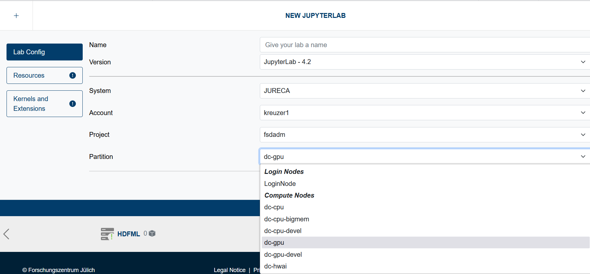
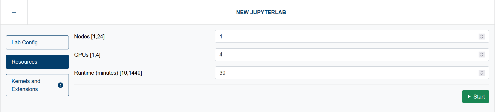

# Available Resources and Tools

Jupyter-JSC provides a variety of options and features to enhance your interactive computing experience. Here’s an overview of what you can expect:

## 1. Systems Available

Jupyter-JSC connects you to several powerful systems:

### 1. HPC

- **JUWELS**
- **JEDI**
- **JURECA**
- **JUSUF**
- **DEEP**

For access to the HPC systems, please visit [JuDoor](https://judoor.fz-juelich.de).

### 2. Cloud

**JSC-Cloud** is accessible to everyone, providing flexible cloud resources without the need for an HPC account. For users utilizing JSC-Cloud, we offer several resource configurations, including:

- **2GB RAM, 1 CPU** for **7 days**
- **4GB RAM, 1 CPU** for **2 days**
- **8GB RAM, 2 CPUs** for **10 hours**

Please note that these flavors may change in the future and are dependent on the available resources.

With JSC-Cloud, each user enjoys **25GB** of **persistent storage**, allowing you to keep your important work safe and accessible. This feature is available not only in the **default JupyterLab versions** but also when using **custom Docker images**. Whether you're developing in a standard environment or tailoring your setup with your own images, you can rest assured that your data is securely stored and easily retrievable.

## 2. Different JupyterLab Versions

Jupyter-JSC supports multiple versions of **JupyterLab**, allowing users to select the environment that best suits their needs. This flexibility ensures compatibility with various extensions and workflows.

Currently available JupyterLab versions:

 - **JupyterLab 4.2** - A default setup of useful kernels, extensions and more. More details [here](https://github.com/easybuilders/JSC/blob/2024/Golden_Repo/j/Jupyter-bundle/Jupyter-bundle-20240520-GCCcore-12.3.0.eb).
> note for **Cloud resources**: your persistent storage is mounted to `/home/jovyan`. Everything outside of this directory will be lost after a restart.
 - **JupyterLab 3.6** - the previous default version. No longer actively supported. More details [here](https://github.com/easybuilders/JSC/blob/2023/Golden_Repo/j/JupyterLabCollection/JupyterLabCollection-2023.3.6-GCCcore-11.3.0.eb).
> note for **Cloud resources**: your persistent storage is mounted to `/home/jovyan`. Everything outside of this directory will be lost after a restart.
 - **Custom Docker Image** - Use your own docker image. More details in [Custom Docker Images](users/jupyterlab/customdockerimage/index.md).
> note for **Cloud resources**: The mount path for your persistent storage is configurable. This flexibility ensures that the storage location does not interfere with the specific requirements of the Docker image you provide. You can easily adapt the mounting path to suit your environment, allowing for a seamless integration of your custom setup.
 - **Repo2Docker ( Binder )** - Build docker images directly from GitHub, GitLab, Zenodo or other sources. More details in [Repo2docker Integration](users/jupyterlab/repo2docker/index.md).

## 3. Utilizing the Full Capabilities of HPC Systems
If you have access to one of the supported HPC systems, you can launch a pre-installed JupyterLab environment on a login node or a compute node.

> When gaining access to a new system, ensure that you have accepted the Usage Agreement for that system through JuDoor. Should you recently receive access to a system, project, or partition, it’s advisable to log in again to refresh your available options. If you continue to experience issues selecting a system, project, or partition, and believe this is incorrect, please free to contact support (link in the footer).

The options available to you will vary based on your user account and the projects you are affiliated with. 

When selecting a **compute node**, you'll notice a new tab on the left side labeled **Resources**. In this tab, you can specify the runtime (in minutes) for your JupyterLab session, as well as the number of nodes or GPUs needed.
> Please note that depending on system demand, starting JupyterLab on a compute node may take some time. If you have a reservation for a specific partition, it will also be visible in the user interface.

---

Explore these options to make the most out of your experience with Jupyter-JSC, whether you are conducting research, teaching, or learning!

